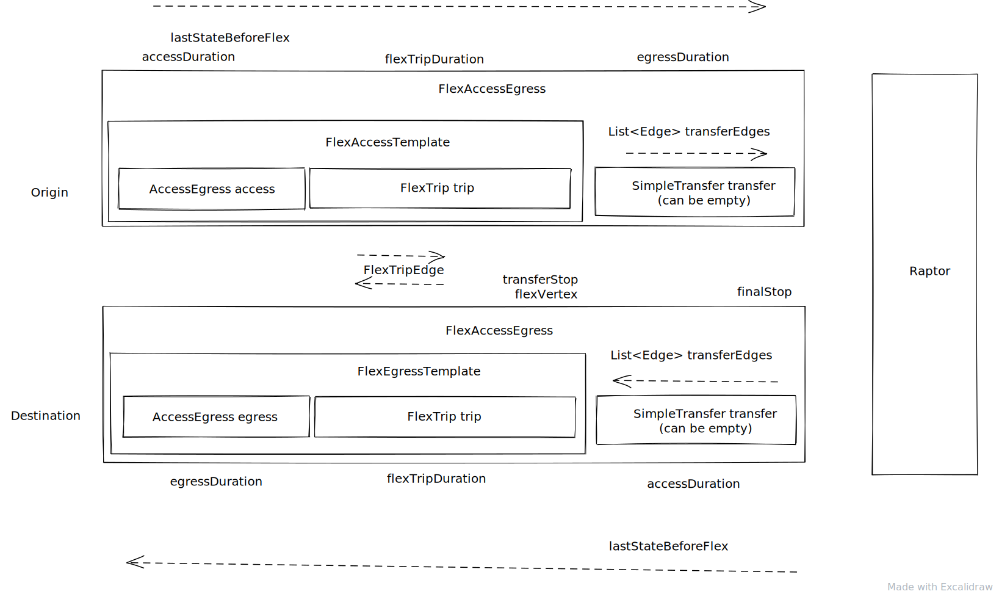

# Flexible transit routing

This package contains a router, which produces access and egress legs for the RAPTOR algorithm, as
well as flex-only itineraries

The data format is based on
the [GTFS-Flex v2.1 draft](https://github.com/MobilityData/gtfs-flex/blob/master/spec/reference.md).

## Algorithm

The algorithm runs in two phases.

1. Flex access/egress templates are generated from the places reachable by the access/egress mode.
   The templates contain information about how to reach the flex service and the service itself.
2. From these templates, flex accesses are generated by alighting at all places after the boarding.
   If the alighting is not at a stop, transfers are generated to all stops reachable by walking
   distance. For egresses the flow is the opposite.

These accesses and egresses can then be fed to the RAPTOR algorithm similar to how the street
accesses and egresses are.

### FlexTrip

As there is a wide variety of flexible transit services, the business logic for each type exists in
separate classes. To add a new type of service it should be simple to add a new class extending the
FlexTrip class, with the required methods.

#### UnscheduledTrip

This type of trip consists any number of service areas, with a set operating window. The trip is
possible at any time within the set window, and the class can represent multiple potential trips.

#### ScheduledDeviatedTrip

A scheduled deviated trip represents a single trip, which operates not only via stops, but also via
locations, which can be either areas or lines, and groups of locations and stops. As the trip has a
set order of stops, and usually includes at least one timed stop, the driving times are calculated
from the schedules, providing the beginning of the window for boarding and the end of the window for
alighting at the flexible locations, in order to make sure that the trips are possible.

#### ContinuousStopsTrip

A continuous stops trip is a trip which serves regular stops, and where boarding and alighting are
possible also between at least one pair of stops.
